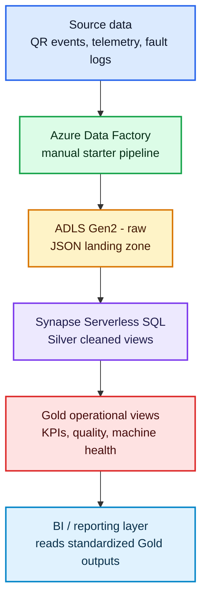

# Azure Serverless Operations Analytics

Azure-native data engineering demo for QR printing and machine telemetry operations.

## Tech Stack

| Layer | Tool | Role |
|---|---|---|
| Orchestration | Azure Data Factory | Runs the starter copy pipeline |
| Storage | ADLS Gen2 | Stores raw and curated project files |
| Query engine | Synapse Serverless SQL | Reads lake files and exposes Silver/Gold views |
| Data model | T-SQL views | Standardizes operational KPI outputs |
| Automation | Azure CLI + shell scripts | Deploys resources, ADF objects, and validation helpers |
| Local utility | Node.js `tedious` | Runs Synapse SQL scripts from the command line |

## Business Context

A beverage production line prints QR codes on every product unit. Operations teams need to know whether the line is producing at the expected speed, whether QR quality is high enough for downstream scanning, and whether machine faults are creating avoidable downtime.

This project models that business flow with three source entities:

| Source | Business meaning |
|---|---|
| `print_events` | Every QR print attempt, print status, QR read result, reject flag, grade score, and position error |
| `machine_telemetry` | Minute-level operating signals such as speed, temperature, vibration, and ink usage |
| `machine_logs` | Warning/fault events and downtime minutes |

The Gold layer answers the core operations questions:

| Question | Gold view |
|---|---|
| How many items were processed and rejected each hour? | `gold_qr_printing.hourly_kpi_summary` |
| Is the machine running near planned speed and healthy limits? | `gold_qr_printing.machine_health_summary` |
| How many faults, warnings, and downtime minutes occurred? | `gold_qr_printing.downtime_fault_summary` |

## Architecture

## Gold Views

- `gold_qr_printing.hourly_kpi_summary`
- `gold_qr_printing.machine_health_summary`
- `gold_qr_printing.downtime_fault_summary`

## Current Status

- Azure resources are created and tagged for project-level cost tracking.
- Synapse Serverless SQL Silver and Gold views are validated.
- ADF starter copy pipeline is deployed and has succeeded once.
- No Spark pool, Dedicated SQL Pool, VM, or always-on compute is used.

## Project Files

- [PROJECT_PLAN.md](PROJECT_PLAN.md) - project scope, architecture, cost controls, and resource names
- [docs/azure_resources.md](docs/azure_resources.md) - deployed Azure resources and tags
- [docs/validation_results.md](docs/validation_results.md) - validated row counts and ADF run result
- [sql/](sql/) - Synapse Serverless SQL setup, Silver views, Gold views, and sample queries
- [adf/](adf/) - Data Factory linked service, datasets, and starter pipeline definitions
